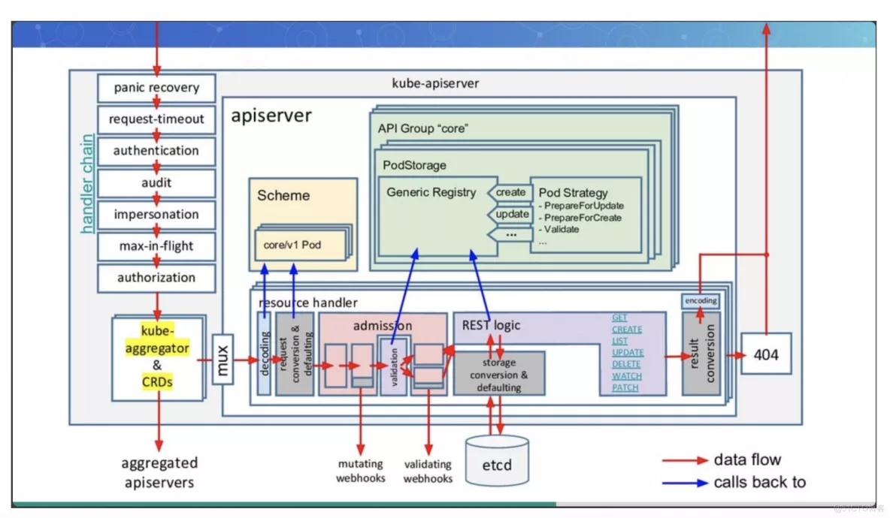

Kubernetes API Server（简称kube-apiserver）是Kubernetes集群中的核心组件之一，它为整个集群提供了RESTful API，可以用来管理集群中的各种资源对象。下面将详细说明kube-apiserver的启动流程和处理流程，以及它具有的主要功能。

## 启动流程

kube-apiserver的启动流程如下：

1. 读取配置文件和命令行参数，确定启动参数和配置信息。kube-apiserver的配置文件包含了许多配置项，例如API Server的监听地址和端口、TLS证书和密钥、Bearer Token认证和RBAC授权等。命令行参数可以用来覆盖配置文件中的配置项，以便在运行时进行动态调整。
2. 启动认证和授权功能，包括TLS证书、Bearer Token认证和RBAC授权等。kube-apiserver通过TLS证书来保障API Server的安全性，客户端可以使用证书来进行身份验证。同时，kube-apiserver还支持Bearer Token认证和RBAC授权，可以根据预定义的权限规则来控制客户端的访问权限。
3. 启动API Server的RESTful API端点，包括Kubernetes API、OpenAPI和Swagger等。Kubernetes API是kube-apiserver提供的核心API，用于管理Kubernetes集群中的各种资源对象。OpenAPI和Swagger是API Server的文档生成器，可以根据API的定义自动生成API文档，方便客户端进行开发和使用。
4. 启动API Server的Admission Control功能，包括Mutating Admission Webhook和Validating Admission Webhook等。Admission Control是kube-apiserver的核心功能之一，可以在资源对象创建、更新和删除等操作时进行预处理和校验，从而防止恶意或错误操作对集群造成危害。
5. 启动API Server的存储和持久化功能，包括etcd存储和数据备份等。kube-apiserver将所有的资源对象存储在etcd数据库中，并支持数据备份和恢复等功能，以保障集群数据的安全和可靠性。

## 处理流程

kube-apiserver的处理流程如下：

1. 接收来自客户端的HTTP请求，并进行身份验证和授权等处理。客户端可以使用curl命令或者Kubernetes API客户端来发送HTTP请求，API Server会先进行身份验证和授权等处理，确定请求的合法性和权限。
2. 根据请求的URL和HTTP方法，确定需要调用的API Server的RESTful API端点。Kubernetes API包含了很多资源对象和操作，例如Pod、Deployment、Service等，客户端可以根据URL和HTTP方法来指定需要操作的资源对象和操作类型。
3. 调用相应的RESTful API端点，将请求转发给相应的资源对象处理器。API Server的RESTful API端点对应着不同的资源对象和操作类型，API Server会根据请求的URL和HTTP方法来确定需要调用的端点，并将请求转发给相应的资源对象处理器进行处理。
4. 资源对象处理器根据请求的资源类型和操作类型，进行相应的逻辑处理，包括对象创建、更新、删除和查询等操作。资源对象处理器是kube-apiserver的核心组件，负责对资源对象进行CRUD操作，处理器会根据请求的资源类型和操作类型来进行相应的逻辑处理，例如创建Pod、更新Deployment、删除Service等。
5. 处理器将处理结果返回给API Server，API Server将结果封装成HTTP响应返回给客户端。处理器处理完成后，会将处理结果返回给API Server，API Server会将结果封装成HTTP响应，包括状态码、HTTP头和响应体等，返回给客户端。

## 主要功能

kube-apiserver具有以下主要功能：

1. 提供RESTful API：kube-apiserver为整个Kubernetes集群提供了RESTful API，可以用来管理集群中的各种资源对象，例如Pod、Deployment、Service等。
2. 认证和授权：kube-apiserver支持TLS证书、Bearer Token认证和RBAC授权等功能，可以保障API Server的安全性，并根据预定义的权限规则来控制客户端的访问权限。
3. Admission Control：kube-apiserver支持Admission Control，可以在资源对象创建、更新和删除等操作时进行预处理和校验，从而防止恶意或错误操作对集群造成危害。
4. 存储和持久化：kube-apiserver将所有的资源对象存储在etcd数据库中，并支持数据备份和恢复等功能，以保障集群数据的安全和可靠性。
5. 扩展性和插件化：kube-apiserver支持扩展性和插件化，可以根据需要添加自定义的API和资源对象，从而扩展API Server的功能和能力。
6. 高可用和负载均衡：kube-apiserver支持高可用和负载均衡，可以通过多个API Server实例来实现高可用和负载均衡，从而提高API Server的可用性和性能。
7. OpenAPI和Swagger：kube-apiserver支持OpenAPI和Swagger，可以根据API的定义自动生成API文档，方便客户端进行开发和使用。

在Kubernetes集群中，apiserver是所有组件之间的核心通信枢纽，提供了对集群内部各种资源对象的管理和操作接口。因此，大多数操作都需要通过访问apiserver来完成，包括：

1. 管理Kubernetes对象：例如Pod、Deployment、Service等。
2. 执行Kubernetes操作：例如创建、更新、删除等。
3. 监控Kubernetes集群：例如获取集群状态、查看事件等。
4. 配置Kubernetes对象和集群：例如配置存储、网络和安全等。

由于apiserver具有核心的管理和控制功能，因此只有经过身份验证和授权的用户或应用程序才能访问apiserver。在Kubernetes中，可以通过以下方式来访问apiserver：

1. Kubernetes命令行工具（kubectl）：kubectl是Kubernetes的官方命令行工具，可以用来管理Kubernetes集群中的各种资源对象，例如Pod、Deployment、Service等。kubectl通过认证和授权机制来访问apiserver，可以使用TLS证书、Bearer Token认证和RBAC授权等方式进行身份验证和授权。
2. Kubernetes API客户端库：Kubernetes提供了多种编程语言的API客户端库，例如Go、Python、Java等，可以用来编写Kubernetes应用程序和工具，通过API客户端库来访问apiserver。API客户端库同样支持认证和授权机制，可以通过TLS证书、Bearer Token认证和RBAC授权等方式进行身份验证和授权。
3. Kubernetes Web UI：Kubernetes提供了Web UI界面（Dashboard），可以通过Web浏览器来访问apiserver，并管理Kubernetes集群中的各种资源对象。Web UI同样支持认证和授权机制，可以通过TLS证书、Bearer Token认证和RBAC授权等方式进行身份验证和授权。
